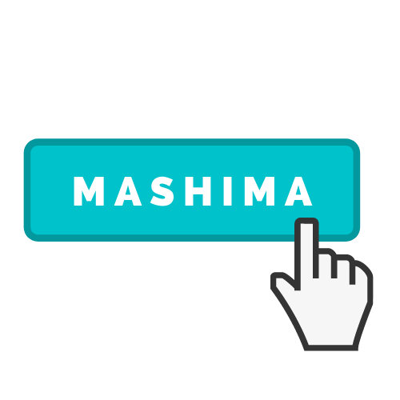

<h1 align="center">  🙌  Hello World  🙌 </h1>

My name is Mashima Button, and I am software engineer who loves to build things, continuously work to improve myself, and loves to have fun with everything I do!

People I work with said I'm hardworking, and fun to work with, but I'll let you be the judge so why don't we get in touch? 😄

**GitHub:** github.com/zimashima

**Twitter:** twitter.com/_zimashima

**LinkedIn:** linkedin.com/in/mashimabutton/

<h2 align="center">  I can code with... 💻 </h2>

 

<h2 align="center">  Tools I use 🛠 </h2>

 

<h2 align="center">  I am familiar with these concepts... </h2>

 
Responsive Designs | Accessibility | Client-side Authentication | Server-side Authentication | Database Designs | State Management | Cloud Computing

<h2 align="center">  Aside from Coding, I do enjoy... </h2>

 
🎮 Video Games

🎬 Series and Movies

🎹 Piano & Music

✈ Traveling

🏝 Beaches

🍽 Eating

🍳 Cooking (I'm Thai and I make great Thai food!)

